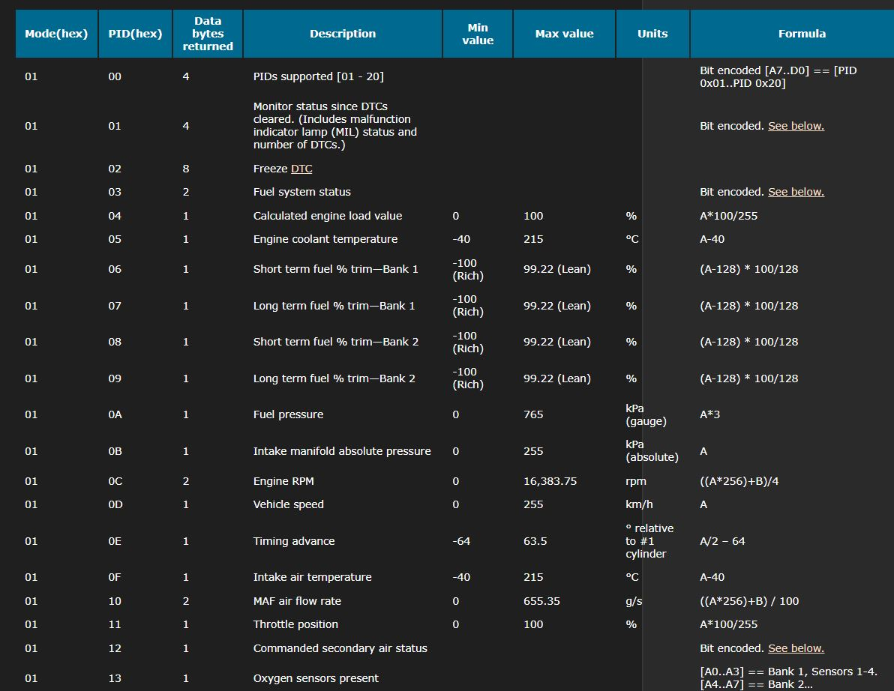
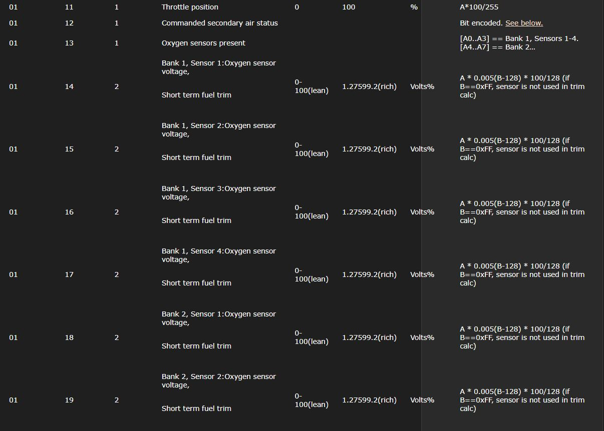
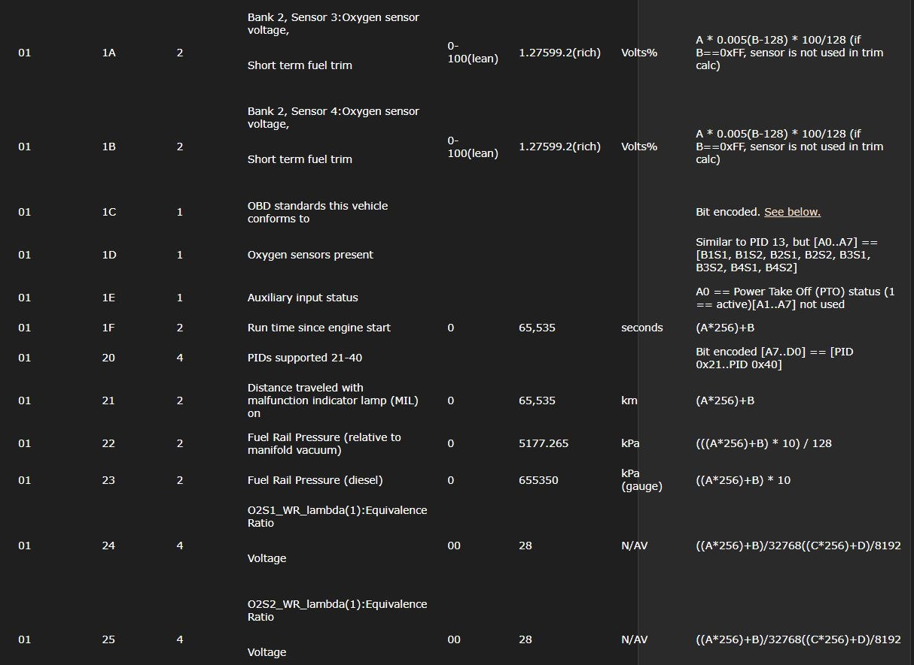
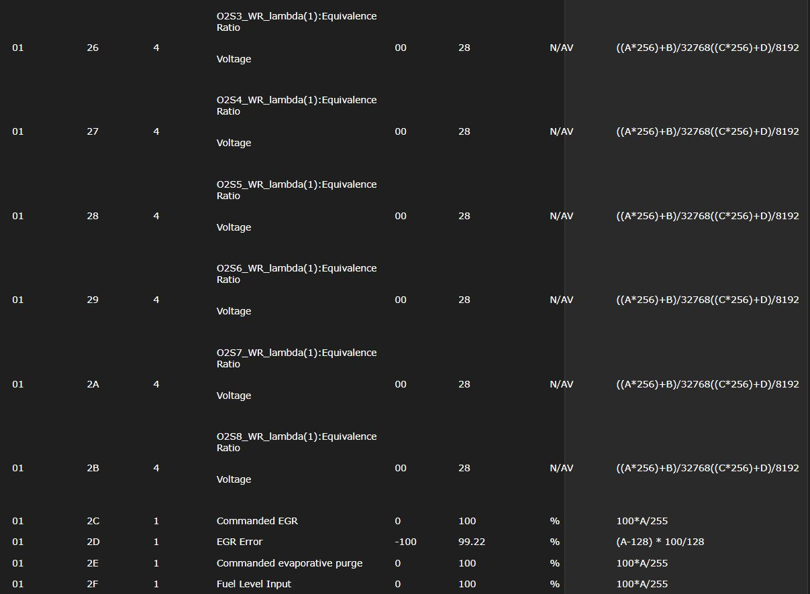
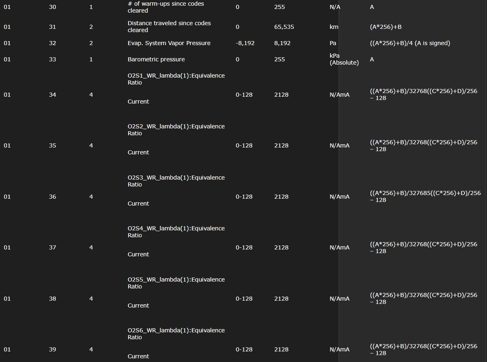
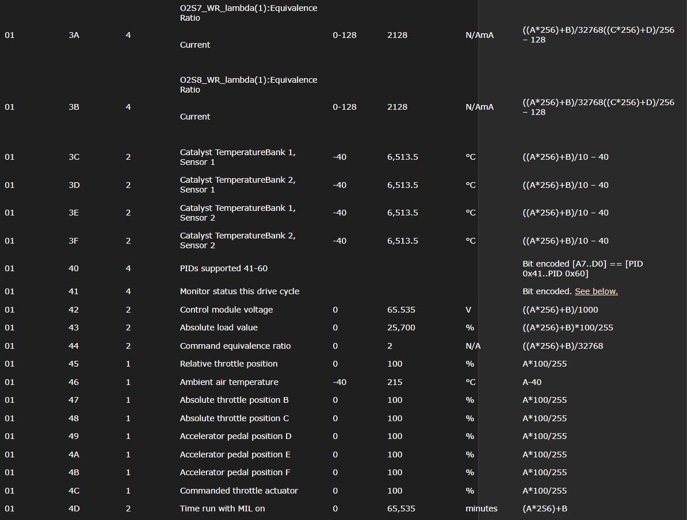
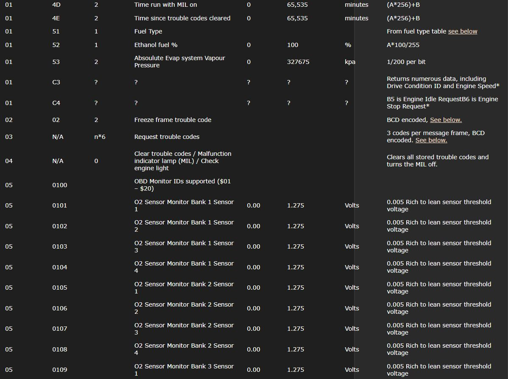

<h1> ZeroW Pi Configuration Files </h1>
  
 <ul>
<li>Instalar raspbian en la tarjeta SD por medio de Balena Etcher
<li>Desde Windows abrir el archivo <i>config.txt</i>
<li>Al final del archivo añadir las siguientes líneas:
  <ul><li><b>dtoverlay=dwc
      <li>enable_uart=1</b>
        
      <li><b>dtoverlay=mcp2515-can0,oscillator=16000000,interrupt=25
      <li>dtoverlay=spi-bcm2835-overlay</b>
  </ul>
</ul>
 Abrir y editar el archivo cmdline.txt agregando:
<ul>
  <li><s>rootwait</s> <b>modules-load=dwc2,g_ether</b>
</ul>
 
 Conectar el monitor y teclado a la Pi, encenderla y configurarla por medio de:
<ul>
  <li><b>sudo raspi-config</b>
</ul>
 
 Configurar la ip stática para el usb mediante la edición del archivo: 
<ul>
  <li>sudo nano /etc/network/interfaces
</ul>
<h2>
 Para tener internet mediante dhcp y realizar la conexión vía wifi, previamente configurada en el wpa_supplicant, El archivo quedaría de la siguiente manera: 
</h2>
<i><h5>

# interfaces(5) file used by ifup(8) and ifdown(8)
 

# Please note that this file is written to be used with dhcpcd

# For static IP, consult /etc/dhcpcd.conf and 'man dhcpcd.conf'
 

# Include files from /etc/network/interfaces.d:

source-directory /etc/network/interfaces.d
 

#allow-hotplug usb0

iface usb0 inet static

 address 192.168.10.2

 netmask 255.255.255.0

 network 192.168.10.0

 broadcast 192.168.10.255

 gateway 192.168.10.1
 

auto wlan0

allow-hotplug wlan0

iface wlan0 inet dhcp

   wpa-conf /etc/wpa_supplicant/wpa_supplicant.conf</i></h5>
 
<h2>

Para tener conexión mediante USB, sin conexión por medio de la Wifi, el archivo quedaría de la siguiente manera:
</h2>

<i><h5>

# interfaces(5) file used by ifup(8) and ifdown(8)

# Please note that this file is written to be used with dhcpcd

# For static IP, consult /etc/dhcpcd.conf and 'man dhcpcd.conf'

# Include files from /etc/network/interfaces.d:

source-directory /etc/network/interfaces.d

allow-hotplug usb0

iface usb0 inet static

	address 192.168.10.2

	netmask 255.255.255.0

	network 192.168.10.0

	broadcast 192.168.10.255

	gateway 192.168.10.1

#auto wlan0

allow-hotplug wlan0

iface wlan0 inet dhcp

	wpa-conf /etc/wpa_supplicant/wpa_supplicant.conf

</i></h5>

<h2>Para realizar la conexión USB mediante Windows, es necesaria la siguiente configuración de red en el dispositivo RNDIS GADGET:</h2>
<ul>
  <li>Dirección IP: 192.168.10.1
  <li>Máscara de subred: 255.255.255.0
  <li>Puerta de enlace: 192.168.10.1
</ul>

Realizar un ping a la ZeroW con la dirección <i>192.168.10.2</i>

<h2>Para realizar la conexión USB mediante Linux:</h2>

   Mediante terminal, escribir:
<ul><li><i>lsusb</i></ul>

Se mostrará algo como:
<ul><li><i>Netchip Tecnology,Inc Linux-USB Ethernet/RNDIS Gadget</i></ul>

Luego es necesario mostrar los dispositivos de red mediante:
<ul><li><i>ifconfig</ul></i>

Se mostrará un dispositivo "enp1S0" pero el que interesa es "enp0S29f7U1", después de identificarlo es necesario configurar las direcciones de red mediante el terminal:
<ul><li><i>sudo ipconfig <s>enp0s29f7U1</s> 192.168.10.1 netmask 255.255.255.0</i></ul>

<h2>Conexión mediante SSH</h2>

<ul><li><i>ssh pi@192.168.10.2</i>
       <li>pwd: 431514
  </ul>

<h2>Configuración del archivo wpa_supplicant</h2>

Editar con nano el archivo:
<ul><li>sudo nano /etc/wpa_supplicant/wpa_supplicant.conf</ul>

<i>
 ctrl_interface=DIR=/var/run/wpa_supplicant GROUP=netdev
 update_config=1
 country=MX

 network={
   ssid="5P0CKy"
   psk="ZMalqp10"
 }

 network={
   ssid="PH0N3"
   psk="ZMalqp10"
 }

 network={
   ssid="ZMTdeMEXICO"
   psk="ZMTMexico2878"
 }

 network={
   ssid="POPOHUA2"
   psk="ZMalqp10"
 }</i>
 

<h2>Pi Zero W & SPI MCP2551</h2>
 
 <ul>Modificar el archivo /boot/config.txt
      <li><i>sudo nano /boot/config.txt</i>
    </ul>
 <ul>Descomentar en la sección optional hardware interfaces
      <li><i>dtparam=spi=on</i>
    </ul>
 <ul>Agregar las siguientes líneas al final del archivo:
      <li><i>dtoverlay=mcp2515-can0,oscillator=16000000,interrupt=25</i>
      <li><i>dtoverlay=spi-bcm2835-overlay</i>
    </ul>
 

<h2>Instalación CAN UTILS</h2>
 <ul>Instalar can-utils sobre raspbian:
      <li><i>sudo apt-get install can-utils</i>
    </ul>
 <ul>Reiniciar la Pi, si la configuración y el cableado son correctos debe de aparece el siguiente directorio:
      <li><i>/sys/bus/spi/devices/spi0.0/net</i>
    </ul>
 

<h2>Inicio y configuración interface CAN0</h2>
 <ul>Para iniciar la interface can0 y setup:
      <li><i>sudo ip link set can0 up type can bitrate 500000</i>
    </ul>
 <ul>Para detener la interface:
      <li><i>sudo ip link set can0 down</i>
    </ul>
 

<h2>CANDUMP</h2>
 <ul>Para realizar un dump de los paquetes que circulan por la red CAN
      <li><i>candump -c -c -a can0,#FFFFFFFF</i>
      <li>(Muestra toda la información y el dataframe de cualquier Id)
    </ul>
 <ul>Para realizar un dump de los paquetes de un Id en específico:
      <li><i>candump -c -c -a can0,100:7FF</i>
      <li>(Muestra el dataframe de el Id 0x100)
    </ul>
 <ul>Ligas de consulta
      <li><i>https://sgframework.readthedocs.io/en/latest/cantutorial.html</i>
      <li><i>https://manpages.debian.org/testing/can-utils/candump.1.en.html</i>
      <li><i>https://github.com/linux-can/can-utils</i>
    </ul>
 

<h2>Python CAN</h2>
 <ul>Instalación:
      <li><i>pip install python-can</i>
    </ul>

<h4>Ejemplos de uso:</h4>

<h3>"CanBusConfig.py"</h3>
   #Importamos la librería
   import can
   
   #Configuración del bus, canal can0 y velocidad 500KBaud
   bus = can.interface.Bus(bustype='socketcan', channel='can0', bitrate=500000)

<h3>"CanBusListener.py"</h3>
   #Importamos la librería
   import can
   from can import listener
   
   #Configuración del bus, canal can0 y velocidad 500KBaud
   bus = can.interface.Bus(bustype='socketcan', channel='can0', bitrate=500000)
   
   #Función para imprimir el mensaje CANBUS en pantalla
   def PrintMsg(msg):
       print(msg)
   
   #Variable que recibe el mensaje para ser usada como argumento
   msg = bus.recv()
   
   #Listener, recibe como argumento el mensaje CANBUS
   listener = PrintMsg(msg)
   
   #listener.stop()
   
   #Usuario
   print(">> Done!!!")

<h3>"CanBusRx.py"</h3>
   #Importamos la librería
   import can
   
   #Configuración del bus, canal can0 y velocidad 500KBaud
   bus = can.interface.Bus(bustype='socketcan', channel='can0', bitrate=500000)
   
   #Recibe los mensajes del buffer y los muestra en pantalla, de manera ciclíca el pprograma no sale hasta interrupt
   for msg in bus:
       print(msg)

<h3>"CanBusTx.py"</h3>
   #Importamos la librería
   import can
   from can import Message
   
   #Globales
   '''
   The functional PID query is sent to the vehicle on the CAN bus at ID 7DFh, using 8 data bytes. The bytes are:
   
                                                               Byte    
   PID Type	        0	        1	                        2	                                        3	    4	    5	    6	    7
   SAE Standard	Number of       Service                     PID code                                    not used (ISO 15765-2 suggests CCh)
                   additional      01 = show current data;     (e.g.: 05 = Engine coolant temperature)	
                   data bytes:     02 = freeze frame;
                   2	
   '''
   arryFuelFrame = bytearray([2, 1, 47, 204, 204, 204, 204, 204])                              #Los valores de la tabla de arriba están convertidos de hex a int
   queryFuelMsg = Message(is_extended_id=False, arbitration_id=2015, data=arryFuelFrame)       #El ID broascast es 7DF en hex y 2015 en int
   
   #Configuración del bus, canal can0 y velocidad 500KBaud
   bus = can.interface.Bus(bustype='socketcan', channel='can0', bitrate=500000)
   
   #Envío de mensaje CANBUS
   bus.send(queryFuelMsg)
   
   #Detenemos el CANBUS
   bus.shutdown()
   
   #Mostramos el mensaje en pantalla
   print(queryFuelMsg)

<h2>CANSNIFFER from can-utils</h2>

 <ul>Para realizar una captura de paquetes que circulen en la línea CAN:
      <li><i>cansniffer can0</li>
    </ul>

<h1>Envío de datos por medio del CAN BUS</h1>

Para enviar un único frame, se utiliza el comando:
  <ul>
    <li>cansend</li>
  </ul>

Ejemplo de uso:
  <ul>
    <li>cansend can0 123#1122334455667788</li>
  </ul>

Para mostrar la ayuda en pantalla:
  <ul>
    <li>cansend -h</li>
  </ul>

<h1>PID OBD II</h1>

Modes
There are ten modes of operation described in the latest OBD-II standard SAE J1979. They are, the $ prefix indicating a hexadecimal number:

$01. Show current data

$02. Show freeze frame data

$03. Show stored Diagnostic Trouble Codes

$04. Clear Diagnostic Trouble Codes and stored values

$05. Test results, oxygen sensor monitoring (non CAN only)

$06. Test results, other component/system monitoring (Test results, oxygen sensor monitoring for CAN only)

$07. Show pending Diagnostic Trouble Codes (detected during current or last driving cycle)

$08. Control operation of on-board component/system

$09. Request vehicle information

$0A. Permanent DTC’s (Cleared DTC’s)

Vehicle manufactures are not required to support all modes.

Each manufacturer may define additional modes above #9 (e.g.: mode 22 as defined by SAE J2190 for Ford/GM, mode 21 for Toyota) for other information (e.g.: the voltage of the Traction Battery in a HEV).

<h1>Standard PIDs</h1>

The table below shows the standard OBD-II PIDs as defined by SAE J1979. The expected response for each PID is given, along with information on how to translate the response into meaningful data. Again, not all vehicles will support all PIDs and there can be manufacturer-defined custom PIDs that are not defined in the OBD-II standard.

Note that modes 1 and 2 are basically identical, except that Mode 1 provides current information, whereas Mode 2 provides a snapshot of the same data taken at the point when the last diagnostic trouble code was set. The exceptions are PID 01, which is only available in Mode 1, and PID 02, which is only available in Mode 2. If Mode 2 PID 02 returns zero, then there is no snapshot and all other Mode 2 data is meaningless.

